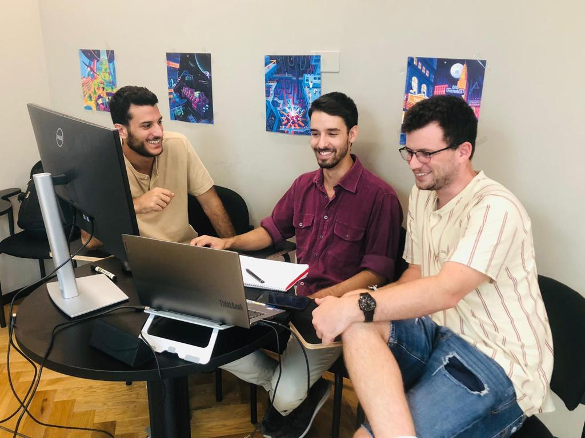
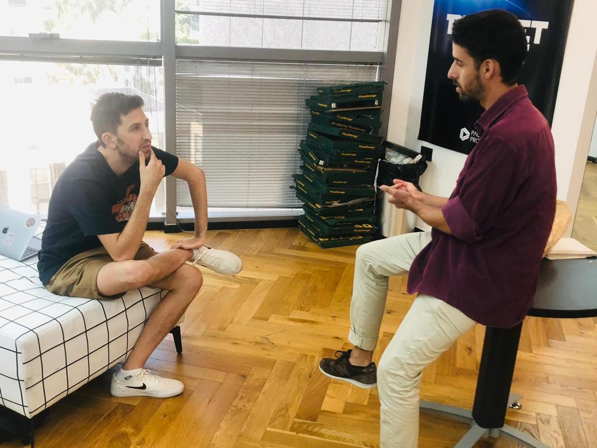
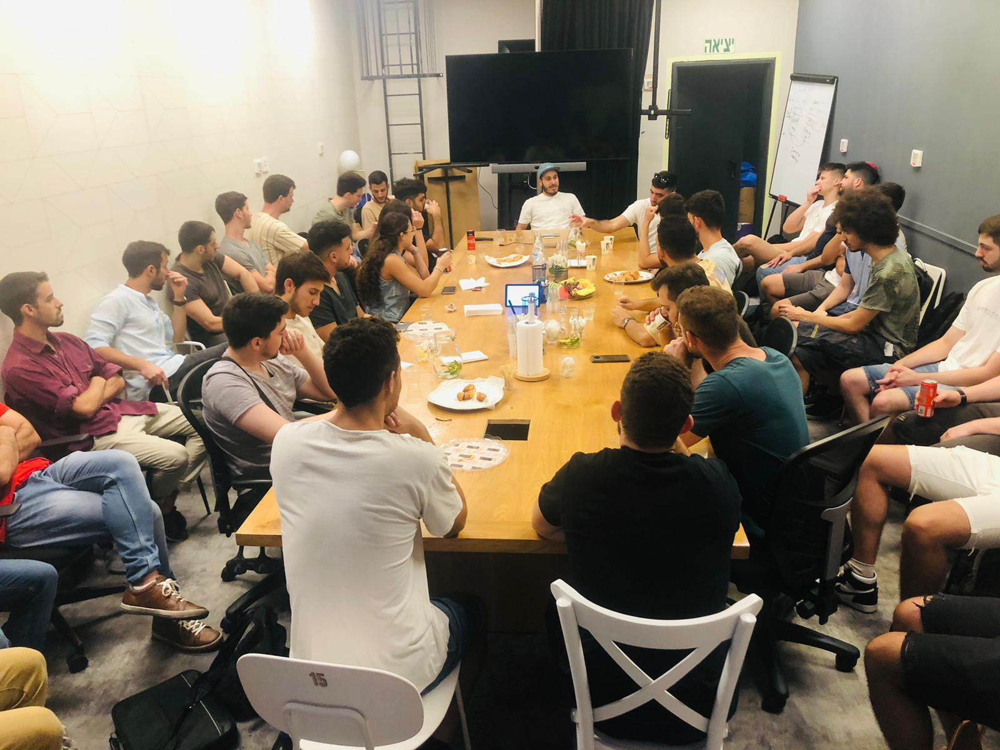
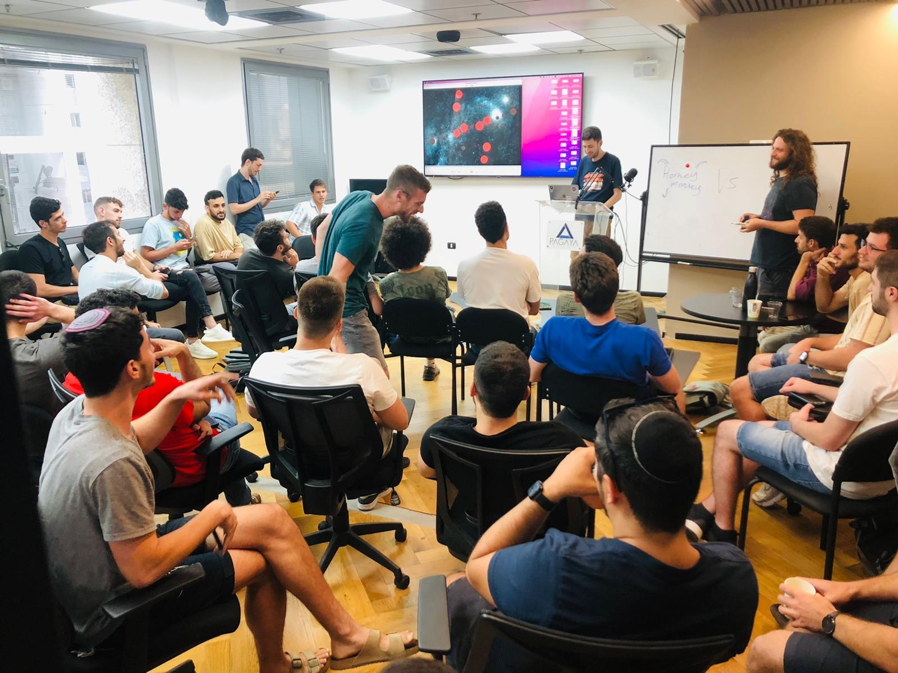

# PlanetWars


## About

Hacathon with <a herf="https://pagaya.com/">"Pagaya"</a> company by <a herf="hhttps://suvelocity.org/">"Cyber4s"</a> bootcamp.

On Wednesday, August 3rd, We were gathered at "Pagaya" offices in Tel-Aviv, when Python was a new technology for us. We were divided into groups of 3 to build the best AI, And the best AI won 😎

<b>Our project is "the_killers.py" file.<b>

Planet wars spec:

https://docs.google.com/document/d/1FaeVLqR_0lHKfdfuGyfU9V0c3_inaOxJn5PjtcDdE84/edit#


GitHub hackathon repo:

https://github.com/ronoi99/PlanetWars

## Technologies


## Team "The killers"
```
@itayeylath Itay Eylath
```
```
@omer117 Omer Asraf
```
```
@ycassuto Yuval Cassuto
```


