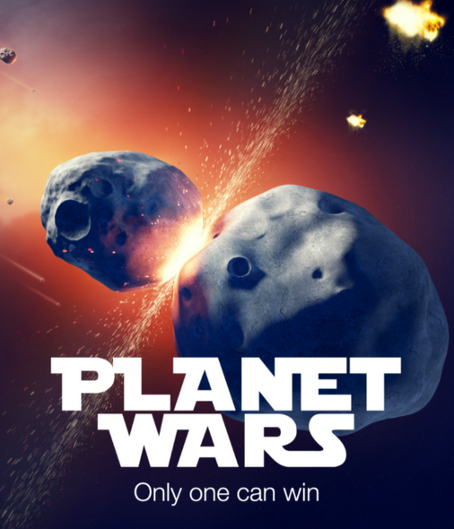

# PlanetWars



## About

Hacathon with <a herf="https://pagaya.com/">Pagaya company</a> by "Cyber4s" bootcamp.

At wednesday, August 3rd, We met in Tel-aviv in Pagaya offices, when Python was new to us.
We competed with each other, while working as a team.
And the best AI won 😎
<b>Our project is "the_killers.py" file.<b>

Planet wars spec:

https://docs.google.com/document/d/1FaeVLqR_0lHKfdfuGyfU9V0c3_inaOxJn5PjtcDdE84/edit#


GitHub hackathon repo:

https://github.com/ronoi99/PlanetWars

## Technologies


## Team "The killers"
```
@itayeylath Itay Eylath
```
```
@omer117 Omer Asraf
```
```
@ycassuto Yuval Cassuto
```